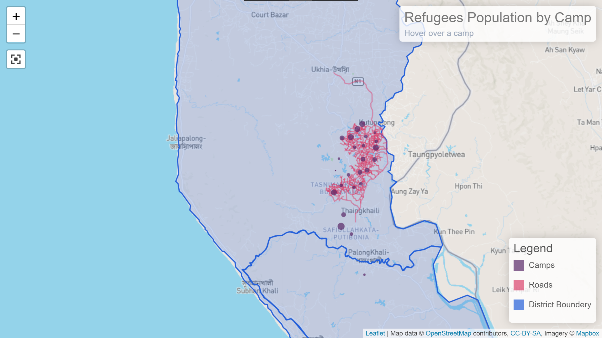

# Rohingya Refugees Camp location & Population


A web map app to visualize Rohingya Refugees settlement data.

# Demo
[https://rohingaloc.herokuapp.com/](https://rohingaloc.herokuapp.com/)

# Features
- **NoSQL database**: [MongoDB](https://www.mongodb.com) object data modeling using [Mongoose](https://mongoosejs.com)
- **Bootstrap 5**: [Bootstrap](https://getbootstrap.com/)
- **Express**: [Express](https://expressjs.com/) Node.js web application framework
- **Leaflet**: [Leaflet](https://leafletjs.com/)
- **Leaflet Full Screen Control:**: [https://github.com/Leaflet/Leaflet.fullscreen](https://github.com/Leaflet/Leaflet.fullscreen)

## Manual Installation

If you would like to do the installation manually, follow these steps:

Clone the repo:

```bash
git clone https://github.com/mazedm80/Geo-WebMap.git
cd Geo-WebMap
```
Install the dependencies:

```bash
npm install
```
Running locally:

```bash
npm start
```
## Project Structure

```
src\
 |--bin\            # App entry point
 |--data\           # Raw data
 |--database\       # MongoDB configuration
 |--models\         # Mongoose models
 |--public\         # Static folder
 |--routes\         # Routes
 |--app.js          # Express app
```
### API Endpoints

**List of available routes**:\
`GET /v1/api/camploc` - get all camp location data\
`GET /v1/api/fploc` - get all footpath location data\
`GET /v1/api/aoi` - get all district location data\

Code is very far from being polished and perfect, as this project is created as a University course requirement.